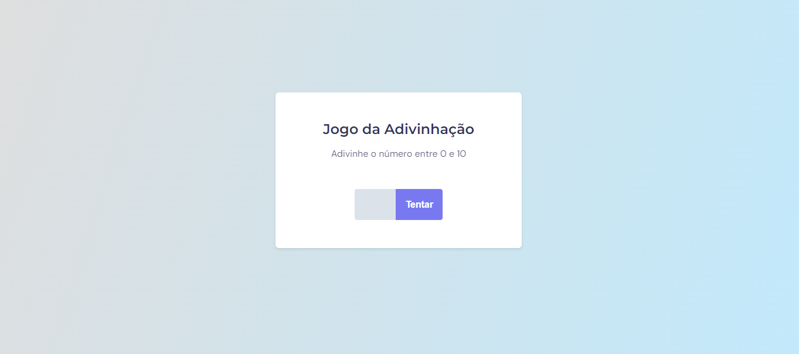
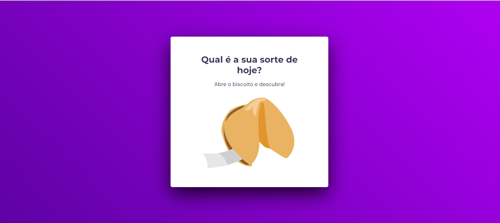

<h1 align="center">📖 Stage 5 - Explorer 📖</h1>

Criação de quatro projetos práticos web seguindo as intruções do design do figma. Esses projetos foram desenvolvidos no programa <a href="https://www.rocketseat.com.br/explorer">Explorer</a> da RocketSeat.

 

<table>
  <thead>
    <tr>
      <th align="center">
        
        

        <small>#</small>
        

      </th>
      <th align="center">
        
        

        <small>
        NAME
        </small>
        

      </th>
      <th align="center">
        
        

        <small>
        PREVIEW
        </small>
        

      </th>
    </tr>
  </thead>
  <tbody>
   <tr>
      <td>01</td>
      <td><a href="jogo-da-adivinhacao">Jogo da Adivinhação</a></td>
      <td align="center">
      </td>
    </tr>
    <tr>
      <td>02</td>
      <td><a href="biscoito-da-sorte">Biscoito da Sorte</a></td>
      <td align="center"></td>
    </tr>
    <tr>
      <td>03</td>
      <td><a href="calculo-imc">Calculadora de IMC</a></td>
      <td align="center"></td>
    </tr>
    <tr>
      <td>04</td>
      <td><a href="timer-focus">Timer Focus - Pomodoro</a></td>
      <td align="center">
      </td>
    </tr>
  </tbody>
</table>

