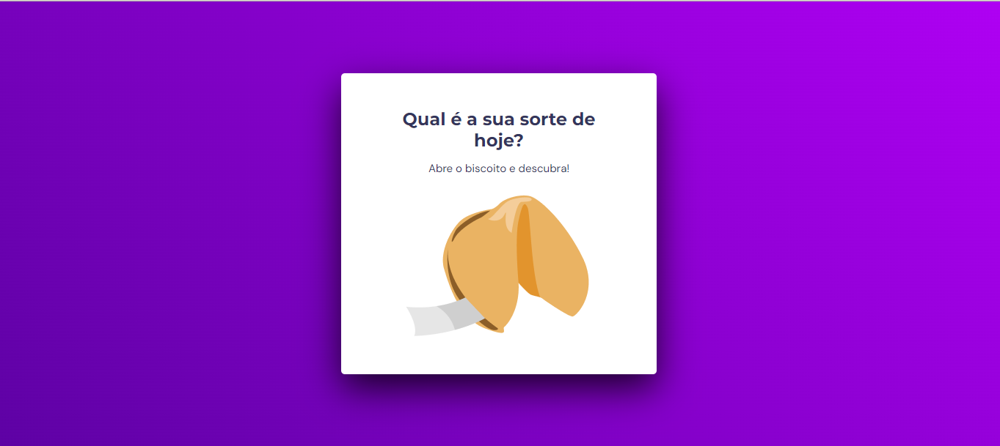
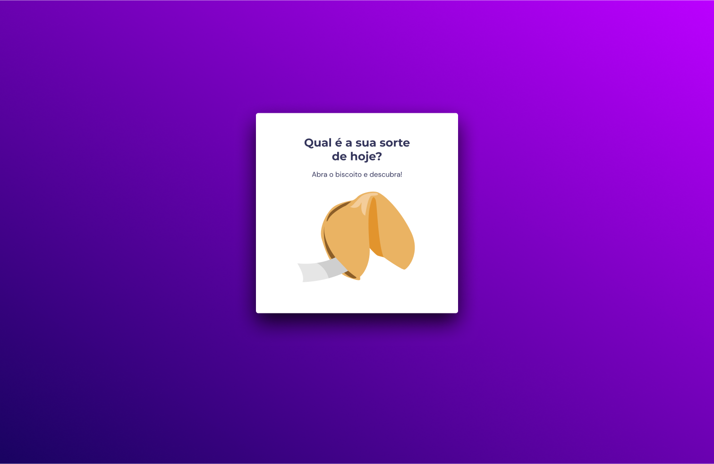
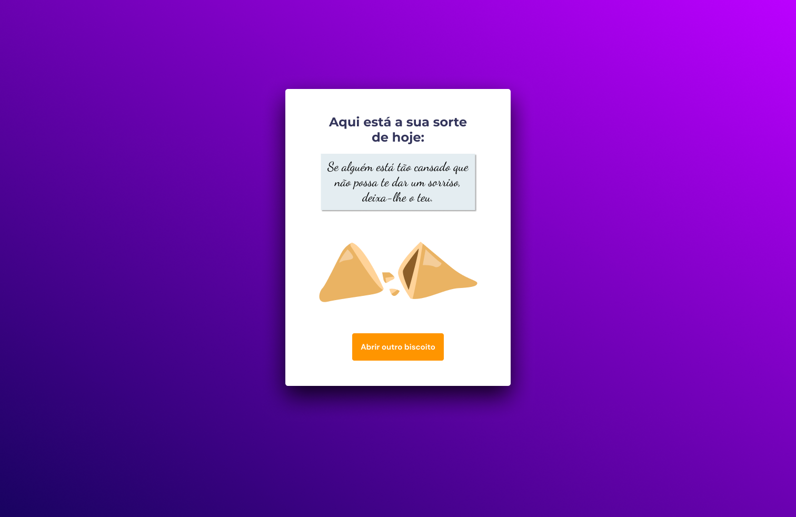

<h1 align="center">🥠 Biscoito da Sorte! 🥠</h1>

Criação de um site web que simula um biscoito da sorte seguindo as instruções do design do figma. Esse projeto foi desenvolvido no programa <a href="https://www.rocketseat.com.br/explorer">Explorer</a> da RocketSeat.

  <a href="#🚀-tecnologias">Tecnologias</a>&nbsp;&nbsp;&nbsp;|&nbsp;&nbsp;&nbsp;
  <a href="#💻-projeto">Projeto</a>&nbsp;&nbsp;&nbsp;|&nbsp;&nbsp;&nbsp;
  <a href="#🔖-layout">Layout</a>&nbsp;&nbsp;&nbsp;

 

  

## 🚀 Tecnologias

Esse projeto foi desenvolvido com as seguintes tecnologias:

- Estrutura de dados HTML
- Animações com CSS
- Funções no Javascript
- Manipulação da DOM
- Biblioteca JS Math()
- Funções *callback*
- Arrays
- Figma

## 💻 Projeto

O site Biscoito da Sorte é um projeto que tem como objetivo ensinar os fundamentos essenciais do JavaScript com foco em funções e manipulação do DOM para a criação da lógica da mensagem do biscoito e fundamentos essenciais do CSS para fazer animações. Além disso, concentramos nossos esforços em garantir que o código seja desenvolvido de maneira semanticamente correta e claro.

- [Acesse o projeto finalizado, online](https://jp-xaxa.github.io/stage05/biscoito-da-sorte/)

## 🔖 Layout

Você pode visualizar o layout do projeto através [DESSE LINK](<https://www.figma.com/file/ubpABYy2OewsKbNsoOb174/Jogo-Adivinha%C3%A7%C3%A3o-(Copy)?type=design&node-id=0-1&mode=design&t=KW2gyto53t2zD8Ef-0>). É necessário ter conta no [Figma](https://figma.com) para acessá-lo.

