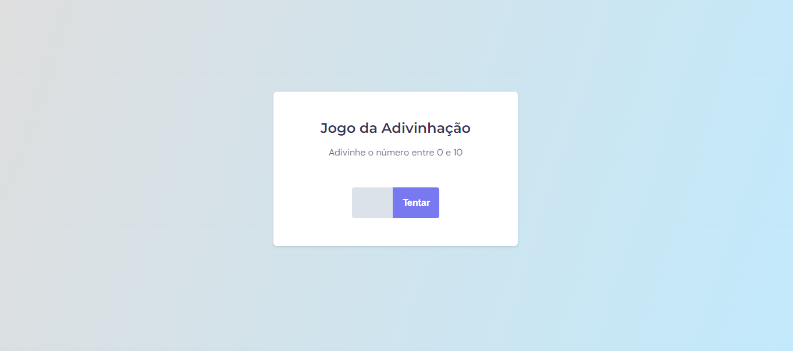

<h1 align="center">💭 Jogo da Adivinhação! 💭</h1>

Criação de um jogo de adivinhação de números web seguindo as instruções do design do figma. Esse projeto foi desenvolvido no programa <a href="https://www.rocketseat.com.br/explorer">Explorer</a> da RocketSeat.

  <a href="#🚀-tecnologias">Tecnologias</a>&nbsp;&nbsp;&nbsp;|&nbsp;&nbsp;&nbsp;
  <a href="#💻-projeto">Projeto</a>&nbsp;&nbsp;&nbsp;

 

  

## 🚀 Tecnologias

Esse projeto foi desenvolvido com as seguintes tecnologias:

- HTML e CSS
- Funções no JavaScript
- Manipulação da DOM
- Figma

## 💻 Projeto

O jogo da adivinhação é um projeto que tem como objetivo ensinar os fundamentos essenciais do JavaScript com foco em funções e manipulação do DOM para a criação da lógica do jogo. Além disso, concentramos nossos esforços em garantir que o código seja desenvolvido de maneira semanticamente correta e claro.

- [Acesse o projeto finalizado, online](https://jp-xaxa.github.io/stage05/jogo-da-adivinhacao/)
